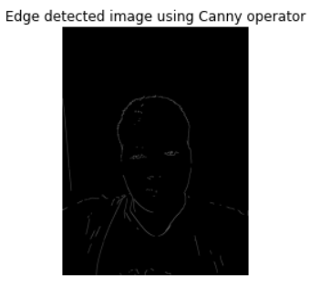

# Canny-edge-detection
# Name : K.Balaji
# Register number : 212221230011
# Question
### To perform canny edge detection for a image.
# Program
```
#Original image
import cv2
import matplotlib.pyplot as plt
a=cv2.imread('my.jpg',1)
gray=cv2.cvtColor(a,cv2.COLOR_BGR2GRAY)
gaus=cv2.GaussianBlur(gray,(3,3),0)
plt.imshow(gaus,cmap='gray')
plt.title('Original image')
plt.axis('off')
```
```
#Canny edge detection
canny=cv2.Canny(gaus,120,150)
plt.imshow(canny,cmap='gray')
plt.title('Edge detected image using Canny operator')
plt.axis('off')

```
# Output
## Original image

## Canny Edge detected image
